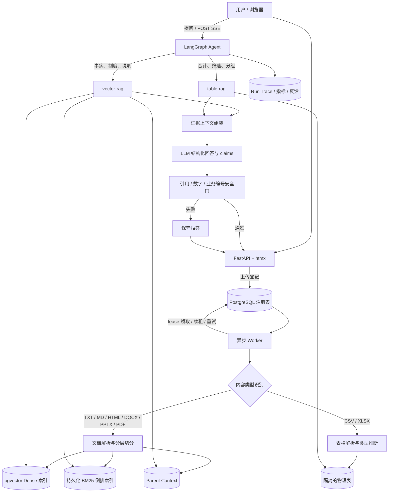

# Minibrain 整体架构与实现说明

> 一句话定位：Minibrain 是一个面向企业知识库的多租户 Agentic RAG 原型。它把非结构化文档交给混合检索，把结构化表格交给受限 SQL，再由带持久化会话的 Agent 统一路由，并在答案发布前执行引用安全校验。

本文只描述当前产品主路径。`handwritten/` 是教学和实验基线；`modules/graph_rag/` 是受控对照实验，都不是 Web 默认链路。

## 1. 系统全景



核心设计不是“把所有数据都向量化”，而是先判断问题需要哪种数据范式：文档检索负责找原文，SQL 负责精确计算。Agent 只负责选择工具、组织多跳检索和生成答案，权限校验仍然留在每个数据模块内部。

## 2. 一次文档入库发生了什么

1. Web 校验文件大小和用户权限，只登记任务并立即返回。
2. Worker 用 `FOR UPDATE SKIP LOCKED` 领取任务；处理中续租，临时错误指数退避，重试耗尽进入 `dead_letter`。
3. Loader 按真实文件内容识别格式，而不是只相信扩展名：
   - Markdown、HTML、DOCX 保留标题层级；
   - PPTX 保留幻灯片号；
   - 有文字层的 PDF 保留页码；
   - CSV、XLSX 自动路由到 table-rag；
   - 扫描 PDF、纯图片 PPTX、旧 `.doc` 等明确失败，不伪装为成功。
4. 文档执行结构感知的 small-to-big 切分：800 字 child 用于召回，1600 字 parent 独立保存。默认使用 parent-aware 去重，但不展开完整 parent。
5. 同一 child 同时写入 pgvector dense 索引和持久化 BM25 sparse 索引；任何一路失败都会回滚本批半成品。
6. 注册表保存内容 hash、版本、解析方式和 chunk 数。同名同内容直接复用；内容变化时稳定 `document_id` 升版本，并清理旧 dense、sparse、parent 节点。

XLSX 不走上述切分。每个可见 Sheet 建一张独立物理表，推断列类型并保留前导零编号；未计算公式明确拒绝。原始工作簿只保存一次，所有 Sheet 共享生命周期。

### 2.1 LLM Wiki 派生分支

Wiki 不替代正式 RAG，也不反向进入原文索引。它在 ready 文档上建立两个层次的持久化视图：

```text
ready 原文
  ├─ source page：一篇文档的一页忠实摘要
  └─ topic page：由最多 3 个受控更新组成，可被多篇原文共同支持
```

编译器读取当前原文、刚生成的来源页和同一 source 下的已有主题页，输出结构化 JSON 更新计划。
主题通过稳定 slug 合并，`document_revisions` 不可变保存每版解析原文，
`wiki_topic_documents` 保存多对多来源及编译时版本，
`wiki_topic_links` 保存显式主题关系。原文升级会使来源页和受影响主题失效；任何含旧版本来源的
主题都不会参与问答。Wiki 查询仍采用小规模本地 BM25，在当前用户可见且最新的来源页和主题页
中选择 Top 3，再由回答模型生成 W 编号引用。

Wiki 首页本身是确定性索引，并提供轻量 lint：检查过期来源、失败来源页、无来源主题和孤立主题。
编译、查询和显式 lint 事件写入独立日志，但不保存模型内部推理。这个实现覆盖“持久、累积、
可追溯、可维护”的最小闭环，
尚不包含自动实体图谱、语义矛盾裁决或查询结果自动写回。

## 3. 一次问答发生了什么

```text
问题
  → Agent 判断 vector_search / table_query
  → 模块内 SQL 权限过滤
  → 候选召回或只读 SQL
  → 去重、预算控制、证据编号
  → LLM 输出 answer + 原子 claims + evidence_ids
  → 确定性安全门
  → 最终答案或安全拒答
```

### 3.1 文档检索链路

- Dense：pgvector 余弦检索，适合语义改写、产品名和自然语言描述。
- Sparse：持久化 BM25，适合工单号、会议编号和精确关键词。
- Fusion：使用 RRF，只融合名次，不直接相加量纲不同的 dense/BM25 分数。
- Metadata：权限、source、filename、业务编号、年份等过滤尽量在召回 SQL 内完成。
- Selection：先做确定性重复内容和 parent-aware 去重，再按相关性和独立文档覆盖组装上下文。
- Budget：候选池默认 12 条，最终证据最多 12 条、约 4000 token；跨工具调用也会去重。
- 可选实验：MMR、cross-encoder、完整 parent 展开、HyDE 均有实现或实验记录，但因消融结果默认关闭。

检索会输出 `evidence_found / uncertain / no_evidence` 三态。空结果或精确业务编号不存在可以确定性拒答；相似度分数硬阈值目前只观测、不拦截，因为 held-out 上误拒率为 26.7%，同时没有识别出无答案题。

### 3.2 表格查询链路

表格问题由 LLM 生成 SQL，但执行前有四层护栏：

1. 当前用户可见表名白名单；
2. 仅允许一条 `SELECT` / `WITH`；
3. 外层强制 `LIMIT`；
4. 数据库只读事务与 `statement_timeout`。

所以“华东区销售额合计”不会把表格切成 chunk 后猜结果，而是交给数据库计算。

### 3.3 Agent 与多跳

- 产品路径使用 LangGraph，PostgreSQL checkpointer 保存完整会话。
- 单次模型请求只带最近 6 个完整 turn，并受约 8000-token 历史预算限制，不拆断 tool call。
- 同一轮重复 query 会被确定性拦截；Agent 应改查当前证据暴露出的中间实体和缺失关系。
- 单次工具调用最多拿 3 条证据，为后续跳保留全局预算。
- 同一 `thread_id` 用 PostgreSQL advisory lock 串行化；`request_id` 唯一索引保证成功请求重试时不重复调用模型。

### 3.4 回答安全门

最终模型必须返回结构化 `answer + claims`。每个原子 claim 显式列出证据编号，服务端不再调用第二个 LLM，而是确定性检查：

- 引用编号是否真实存在；
- 每个事实 claim 是否至少有有效引用；
- claim 中的数字和业务编号是否出现在它引用的证据中。

任何硬校验失败，已生成答案不会直接发布，而会被替换为保守拒答。SSE 因此只流 `started / heartbeat / completed / failed` 状态和校验后的最终答案，不直接流不可撤回的原始 token。

## 4. 权限、隔离与安全

- 普通用户只能召回公共知识和自己的知识；管理员可见全部。
- 可见性条件进入向量库/业务库 SQL 的 `WHERE`，不采用“全量召回后在应用层过滤”。
- vector-rag、table-rag 使用不同 PostgreSQL schema，连接池固定 `search_path`。
- 检索缓存键包含用户、管理员身份、可见知识版本、query 和全部检索参数；知识更新或删除后版本变化，缓存自然失效。
- 文档内容统一包裹为不可信证据。疑似 prompt injection 会被标记，但不会被当作系统指令执行。
- 删除文档会同时清理注册表关联、dense、sparse 和 parent；只读索引审计可发现孤儿节点。

当前没有通用 PII/密钥识别、静态脱敏和外部数据源 CDC，因此不能把它描述成完整企业 DLP 系统。

## 5. 可观测性和评测闭环

每次运行保存工具轨迹、候选和最终证据、claims、丢弃原因、延迟、token、模型版本和稳定错误码。Web 提供：

- 运行记录：复盘单次问答；
- 检索实验室：展示 Dense → BM25 → RRF → 去重 → 可选 CE/MMR → parent 的逐阶段排名和耗时；
- 指标页：成功率、无证据率、p50/p95、token、引用覆盖、差评和错误类型；
- 反馈闭环：赞/踩关联 `run_id`，差评可以导出为待人工审核的回归候选。

评测分三层：

| 层次 | 数据与指标 | 解决的问题 |
|---|---|---|
| 自造企业集 | 58 道可答题、8 道无答案题；Recall、MRR、NDCG、Complete Recall | 权限、编号、metadata、多跳和路由 |
| 公开小型集 | NanoNQ、NanoHotpotQA，各 50 题 | 防止只对自造语料调优 |
| 端到端回答 | Correctness、Faithfulness、Citation、Relevance、拒答 | 检索正确后，回答是否仍然可靠 |

CI 对公开检索报告设置回归预算：质量绝对下降超过 0.03 或检索 P50 增长超过 50% 时失败。公开集在本地生成候选报告，CI 本身不持有付费 embedding key。

## 6. 关键技术取舍与实验结论

| 决策 | 结论 | 为什么 |
|---|---|---|
| Chunk 800、overlap 0 | 默认启用 | 受控实验优于 1200；段落对齐后 overlap 只制造重复 |
| Dense + BM25 + RRF | 默认启用 | 语义问题与精确编号互补；RRF 避免分数量纲问题 |
| parent-aware 去重 | 默认启用 | Recall@5 0.847→0.886，token 不增加 |
| 完整 parent 展开 | 默认关闭 | token 中位数 +469，答案支持没有提升 |
| MMR | 默认关闭 | NanoHotpotQA Complete Recall@5 从 hybrid 0.82 降至 0.72 |
| cross-encoder | 默认关闭、实验可开 | 排序提升，但企业集 P50 约 14ms→1467ms，context 反而变长 |
| LLM listwise rerank | 运行时代码移除 | 约增加 7.4 秒，未打赢直接扩大上下文的 baseline |
| Query Rewrite / HyDE | 默认关闭 | 58 题实验总体指标下降，HyDE 延迟约 13.3 秒 |
| GraphRAG | 仅对照实验 | 当前语料图检索没有胜出，且权限/增量/并发边界未解决 |
| 分数 no-answer 硬阈值 | 默认关闭 | held-out 误拒 26.7%，无答案召回 0% |

这些关闭项不是缺功能，而是“实现或测过后有证据地不用”。面试时应同时讲收益、代价和适用条件，不把局部结论外推成普遍规律。

## 7. 代码地图

| 目录或文件 | 职责 |
|---|---|
| `src/minibrain/web/app.py` | Web、认证、上传、SSE、运行记录与指标接口 |
| `src/minibrain/agent/graph.py` | LangGraph Agent、会话、工具调用、最终回答 |
| `src/minibrain/agent/context.py` | token 预算、独立文档覆盖、跨调用去重 |
| `src/minibrain/agent/citations.py` | 结构化 claim 和确定性引用检查 |
| `src/minibrain/gateway.py` | 模块注册和统一调用边界 |
| `src/minibrain/modules/vector_rag/` | 解析、切分、Dense/BM25/RRF、metadata、MMR/CE、置信度 |
| `src/minibrain/modules/table_rag/` | CSV/XLSX 导入、物理表、受限 SQL |
| `src/minibrain/observability/` | Run Trace、聚合指标和反馈 |
| `src/minibrain/handwritten/` | 手写检索和 agent loop 基线 |
| `scripts/`、`eval/` | 探针、消融、公开集和端到端评测 |

## 8. 能说什么，不能说什么

可以说：这是一个功能完整、可运行、可评测的企业知识库 RAG 原型，重点验证了混合检索、结构化数据分流、权限、可靠入库、引用安全和回归评测。

不要说：它已经支撑 10 万用户、能解析所有 PDF、具备完整 DLP、GraphRAG 已生产化、或者所有实验结论都能推广到任意语料。尚未完成的主要是生产规模验证、OCR/复杂版面、外部连接器、真人盲标和 embedding 双索引迁移。
